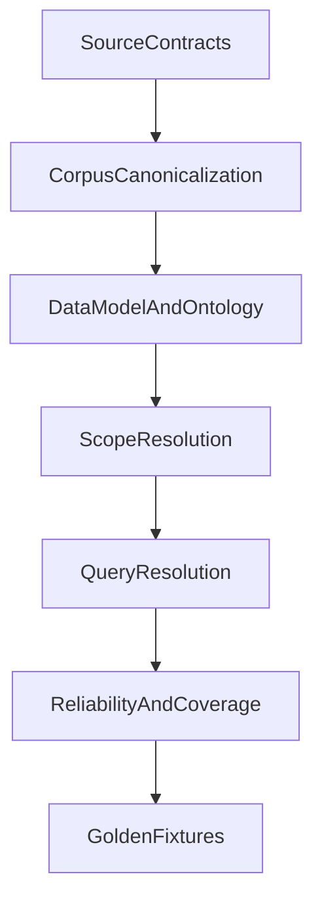

# NCC Specification Master Index

## Status
- Version: `1.0.0`
- Effective date: `2026-04-04`
- Status: normative master index
- Owner: architecture / ingestion / query platform

## Purpose
This document is the authoritative entry point for the NCC specification set in this repository.

It defines:
- which specification documents are normative
- which older documents remain authoritative for compatibility
- which documents are superseded or informative only
- how changes must be made without reintroducing overlap

This index replaces the role previously played by umbrella narrative specs. It does not duplicate detailed contracts.

## Specification Layers

## Normative Documents

| Layer | File | Status | Notes |
|---|---|---|---|
| Master index | `Spec/00_master_index.md` | Normative | Governs ownership, precedence, and document roles. |
| Source contracts | `Spec/xml_source_contract.md` | Normative | XML source fidelity and validation rules remain authoritative. |
| Source contracts | `Spec/pdf_ingestion_contract.md` | Normative | PDF extraction and validation rules remain authoritative. |
| Source contracts | `Spec/xml_source_contract.json` | Normative | Machine-readable XML contract. |
| Source contracts | `Spec/pdf_ingestion_contract.json` | Normative | Machine-readable PDF contract. |
| Source contracts | `Spec/validation_result.schema.json` | Normative | Validation result schema for cross-stage gate enforcement. |
| Source contracts | `Spec/xml_validation_result.schema.json` | Normative | XML validation result schema. |
| Source contract index | `Spec/01_source_contracts/README.md` | Normative | Index and compatibility map for source contracts. |
| Corpus canonicalization | `Spec/02_corpus_canonicalization_spec.md` | Normative | Canonical corpus graph, stable IDs, xref remapping, table normalization, overlays, coverage gates. |
| Scope resolution | `Spec/03_scope_resolution_spec.md` | Normative | Deterministic resolution of legal and query scope. |
| Data model | `Spec/04_data_model_spec.md` | Normative | Core object model and schema responsibilities. |
| Ontology and vocabularies | `Spec/05_ontology_and_vocabularies_spec.md` | Normative | Controlled vocabularies and enum semantics. |
| Query resolution | `Spec/06_query_resolution_spec.md` | Normative | Query interpretation, graph traversal, answer assembly, status handling. |
| Reliability and coverage | `Spec/07_reliability_and_coverage_spec.md` | Normative | Release gates, KPI definitions, evaluation protocol. |
| Golden fixtures | `Spec/08_golden_fixtures_spec.md` | Normative | Fixture authoring standard and flagship query packs. |
| Schemas | `Spec/schemas/*.schema.json` | Normative | Machine contracts for query-layer objects. |
| Machine vocabularies | `Spec/vocabularies/ncc_semantic_vocabularies.json` | Normative | Canonical enum source for query and graph semantics. |

## Legacy And Informative Documents

| File | Status | Role after restructure |
|---|---|---|
| `Spec/NCC_Spec_V5.md` | Legacy normative foundation | Still authoritative for ingestion-first and validation-gate principles where not contradicted by the new root-level docs. |
| `Spec/Candidate_Extraction_Layer.md` | Legacy normative foundation | Still authoritative for candidate-first staging and relation/reconciliation constraints where not contradicted by the new root-level docs. |
| `Spec/Specs Added 04042026/spec (1).md` | Superseded umbrella | Historical umbrella narrative; superseded by this master index plus the new root-level documents. |
| `Spec/Specs Added 04042026/pipeline-spec-v2.md` | Superseded source text | Historical draft input for the new root-level data/query/reliability structure. |
| `Spec/Specs Added 04042026/data-model-spec.md` | Superseded source text | Historical draft input for the new root-level data model and ontology structure. |
| `Spec/Specs Added 04042026/query-resolution-spec.md` | Superseded source text | Historical draft input for the new root-level query spec. |
| `Spec/Specs Added 04042026/system-test-protocol-spec.md` | Superseded source text | Historical draft input for the new reliability spec. |
| `Spec/Specs Added 04042026/golden-fixtures-spec.md` | Superseded source text | Historical draft input for the new fixture spec. |

## Precedence Rules
If two documents overlap, precedence is resolved in this order:

1. Machine-readable schemas and vocabulary files.
2. Root-level normative specs listed in the table above.
3. Existing source contracts and validation schemas.
4. Legacy foundation specs.
5. Superseded or illustrative documents.

No new feature or architectural change may be specified only in a superseded umbrella document.

## Governance Rules
- One document owns one concern. Cross-document references are preferred over duplicated prose.
- Narrative examples are informative unless they are explicitly tied to a schema rule, invariant, or acceptance gate.
- Enumerations must be defined once in `Spec/vocabularies/ncc_semantic_vocabularies.json` and described once in `Spec/05_ontology_and_vocabularies_spec.md`.
- Query-layer objects must be validated against `Spec/schemas/*.schema.json`.
- A document that changes scope semantics, answer status semantics, or relationship semantics must update the ontology and relevant schemas in the same change.
- Corpus changes that affect traversal reliability must update `Spec/02_corpus_canonicalization_spec.md` and `Spec/07_reliability_and_coverage_spec.md`.

## Architecture Intent
The specification set now separates five concerns that were previously blended together:
- source fidelity and ingestion safety
- canonical corpus structure
- legal/query scope determination
- typed graph semantics and machine contracts
- reliability measurement for user-facing answers

This separation is required to support high-reliability human and agentic questions such as:
- "In a Class 2 building in Melbourne what are the required R-Values?"
- "Which of those values apply only to external walls?"
- "What assumption prevented a definitive answer?"

## Change Log
- `2026-04-04`: Created the master index, established document precedence, and superseded umbrella narrative specs with a root-level normative structure.
- `2026-04-07`: Updated the PDF ingestion contract to reflect the Docling inspection viewer, additive PyMuPDF style enrichment, and raw-vs-enhanced output tabs in the current console implementation.
- `2026-04-07`: Clarified in the PDF ingestion contract that additive style enrichment must normalize Docling provenance bbox coordinate origin and ordering before joining PyMuPDF appearance spans to structural blocks.
- `2026-04-09`: Updated the PDF ingestion and candidate-layer specs to document temporary `pdf_only` review payloads plus structured clause header recovery (`clause_code`, `heading_text`, `header_blocks`, `marginalia_blocks`) so editorial annotations do not become candidate titles.
